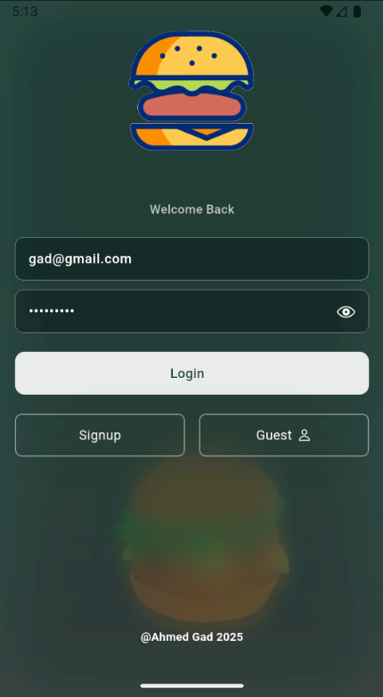
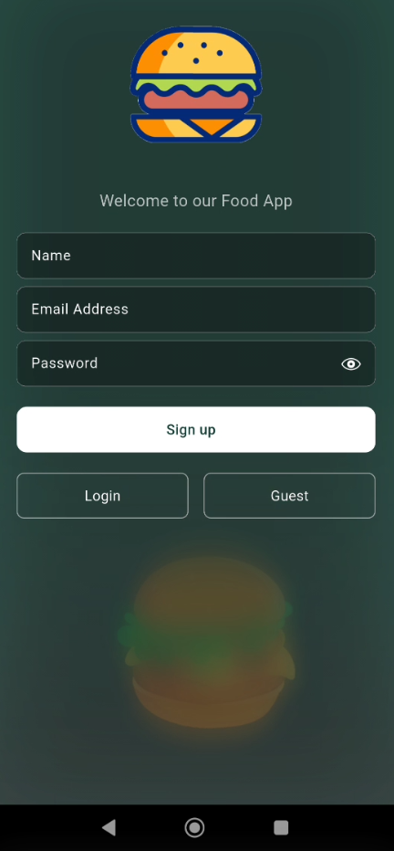
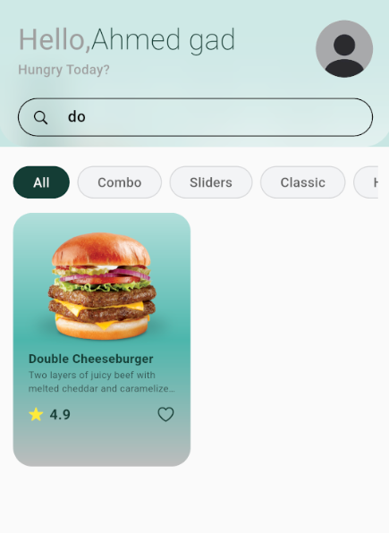
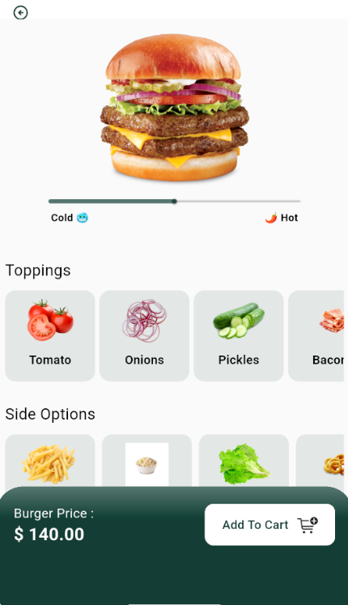
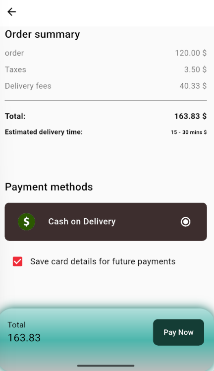
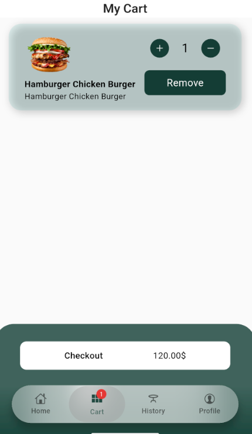
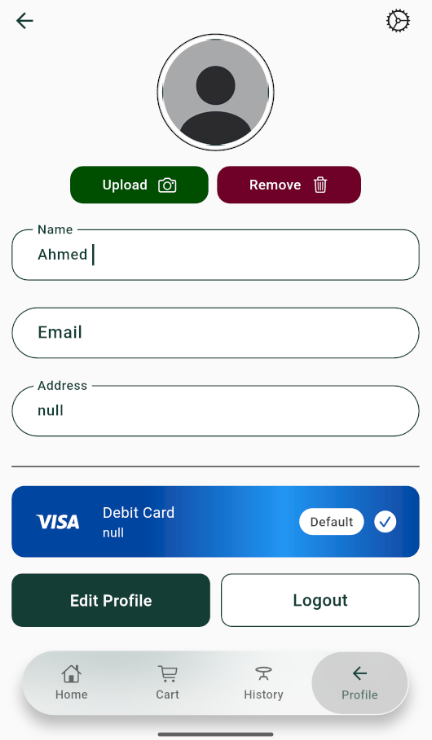

# 🍔 Burger King – Fast Food Ordering App

<div align="center">


**A modern, feature-rich fast food ordering application built with Flutter**

</div>

## 🌟 Overview

**Fast Food App** is a comprehensive mobile application designed for seamless fast food ordering experiences. Built with Flutter and following clean architecture principles, this app provides an intuitive interface for browsing menus, customizing orders, managing carts, and tracking order history.   

## 🌟 screensshots 










### 🎯 Key Highlights

- **🎨 Beautiful UI/UX**: Glassmorphism design with smooth animations
- **🌓 Dark/Light Mode**: Complete theme support with persistent preferences
- **🔐 Authentication**: Secure login/signup with guest mode support
- **🛒 Smart Cart**: Real-time cart management with item customization
- **📱 Responsive**: Adaptive layouts for all screen sizes
- **🚀 Performance**: Optimized with lazy loading and efficient state management
- **🎭 Animations**: Rich micro-interactions using Flutter Animate
- **📦 Offline Support**: Local data persistence with Hydrated Bloc

---

## ✨ Features

### 🔑 Authentication & User Management

- ✅ Email/Password authentication
- ✅ Guest mode for quick browsing
- ✅ Auto-login with session persistence
- ✅ Profile management with image upload
- ✅ Secure credential storage

### 🏠 Home & Product Discovery

- ✅ Dynamic product catalog
- ✅ Category-based filtering
- ✅ Search functionality
- ✅ Featured items carousel
- ✅ Product recommendations
- ✅ 3D product previews (Model Viewer)

### 🛍️ Shopping Experience

- ✅ Interactive product details
- ✅ Customizable options (size, toppings, extras)
- ✅ Add to cart with animations
- ✅ Real-time price calculations
- ✅ Cart badge notifications

### 🛒 Cart Management

- ✅ View all cart items
- ✅ Quantity adjustments
- ✅ Item removal with undo
- ✅ Total price calculation
- ✅ Apply discount codes
- ✅ Persistent cart state

### 💳 Checkout & Orders

- ✅ Multiple payment methods
- ✅ Delivery address management
- ✅ Order confirmation
- ✅ Real-time order tracking
- ✅ Order history with details

### 🎨 UI/UX Features

- ✅ Glassmorphism navigation bar
- ✅ Skeleton loading states
- ✅ Lottie animations
- ✅ Custom snackbars
- ✅ Smooth page transitions
- ✅ Haptic feedback
- ✅ Pull-to-refresh

### 🌓 Theme System

- ✅ Light/Dark mode toggle
- ✅ Harmonious green/teal color palette
- ✅ Theme persistence with SharedPreferences
- ✅ Bloc-based theme management
- ✅ Consistent white text across themes
- ✅ Adaptive UI components

---

## 🏗️ Architecture

This project follows **Clean Architecture** principles with **Feature-First** organization:

```
lib/
├── core/                    # Core functionality
│   ├── constants/          # App-wide constants
│   ├── network/            # API clients & interceptors
│   ├── theme/              # Theme configuration
│   └── utils/              # Utility functions
├── features/               # Feature modules
│   ├── auth/              # Authentication
│   │   ├── data/          # Repositories & models
│   │   ├── views/         # UI screens
│   │   └── widgets/       # Feature-specific widgets
│   ├── home/              # Home & product listing
│   ├── cart/              # Shopping cart
│   ├── checkout/          # Checkout process
│   ├── orderHistory/      # Order tracking
│   └── productDetail/     # Product details
├── shared/                # Shared widgets
│   ├── custom_button.dart
│   ├── custom_text.dart
│   ├── custom_txtfield.dart
│   ├── glass_container.dart
│   └── glass_nav.dart
├── main.dart              # App entry point
├── root.dart              # Bottom navigation root
└── splash.dart            # Splash screen
```

### 🔄 Data Flow

```
View → Bloc/Provider → Repository → API/Local Storage
  ↑                                        ↓
  └────────────── State Update ────────────┘
```

---

## 🛠️ Tech Stack

### Core Framework

- **Flutter** `^3.9.2` - UI framework
- **Dart** `^3.9.2` - Programming language

### State Management

- **flutter_bloc** `^9.1.1` - Business logic component
- **hydrated_bloc** `^10.1.1` - State persistence
- **provider** `^6.1.0` - Dependency injection

### UI/UX

- **flutter_screenutil** `^5.9.3` - Responsive design
- **flutter_animate** `^4.5.2` - Animations
- **lottie** `^3.3.2` - Lottie animations
- **flutter_svg** `^2.2.1` - SVG rendering
- **skeletonizer** `^2.1.0+1` - Loading skeletons
- **gap** `^3.0.1` - Spacing widgets

### Networking & Storage

- **dio** `^5.9.0` - HTTP client
- **shared_preferences** `^2.5.3` - Local storage
- **path_provider** `^2.1.5` - File system paths

### Media & Assets

- **image_picker** `^1.2.0` - Image selection
- **model_viewer_plus** `^1.9.3` - 3D model rendering

### Development Tools

- **device_preview** `^1.3.1` - Device preview
- **flutter_launcher_icons** `^0.14.4` - App icons
- **flutter_lints** `^5.0.0` - Linting rules

---

## 📁 Project Structure

### Feature Organization

Each feature follows this structure:

```
feature_name/
├── data/
│   ├── models/           # Data models
│   ├── repositories/     # Data layer
│   └── providers/        # API providers
├── views/
│   └── feature_view.dart # UI screens
└── widgets/
    └── feature_widget.dart # Reusable widgets
```

### Core Modules

#### 🎨 Theme System

- **app_theme.dart** - Material theme definitions
- **theme_bloc.dart** - Theme state management
- **theme_event.dart** - Theme events
- **theme_state.dart** - Theme states

#### 🌐 Network Layer

- **api_client.dart** - Dio configuration
- **api_endpoints.dart** - API endpoints
- **interceptors.dart** - Request/response interceptors

#### 🎯 Constants

- **app_colors.dart** - Color palette
- **app_strings.dart** - String constants

---

## 🚀 Installation

### Prerequisites

- Flutter SDK `^3.9.2`
- Dart SDK `^3.9.2`
- Android Studio / VS Code
- Git

### Step-by-Step Guide

1. **Clone the repository**

   ```bash
   git clone https://github.com/AhmedAljamal15/Burger_King.git
   cd fast_food
   ```

2. **Install dependencies**

   ```bash
   flutter pub get
   ```

3. **Generate launcher icons**

   ```bash
   flutter pub run flutter_launcher_icons
   ```

4. **Run the app**

   ```bash
   # Development mode
   flutter run

   # Release mode
   flutter run --release

   # Specific device
   flutter run -d <device_id>
   ```

5. **Build for production**

   ```bash
   # Android APK
   flutter build apk --release

   # Android App Bundle
   flutter build appbundle --release

   # iOS
   flutter build ios --release
   ```

---

## ⚙️ Configuration

### Environment Setup

1. **API Configuration**

   Update `lib/core/network/api_endpoints.dart`:

   ```dart
   class ApiEndpoints {
     static const String baseUrl = 'YOUR_API_BASE_URL';
     static const String products = '/products';
     static const String auth = '/auth';
     // Add more endpoints
   }
   ```

2. **Theme Configuration**

   Customize colors in `lib/core/theme/app_colors.dart`:

   ```dart
   class AppColors {
     static const Color primary = Color(0xFF103E34);
     static const Color accent = Color(0xFF26A69A);
     // Customize your palette
   }
   ```

3. **Screen Sizes**

   Adjust responsive design in `lib/main.dart`:

   ```dart
   ScreenUtilInit(
     designSize: const Size(375, 812), // Your design dimensions
     builder: (context, child) => const MyApp(),
   )
   ```

---

## 📖 Usage

### Running the App

```bash
# Development with hot reload
flutter run

# With device preview
flutter run --dart-define=DEVICE_PREVIEW=true

# Profile mode (performance testing)
flutter run --profile

# Release mode
flutter run --release
```

### Authentication Flow

1. **First Launch**: User sees splash screen
2. **Auto-Login Check**: App checks for saved credentials
3. **Routes**:
   - Logged in → Home screen
   - Guest mode → Home screen (limited features)
   - No session → Login screen

### Theme Switching

Users can toggle between light/dark mode:

- Navigate to **Profile** screen
- Tap the **sun/moon icon** in the AppBar
- Theme persists across app restarts

### Cart Management

```dart
// Add item to cart
cartBloc.add(AddToCart(product));

// Update quantity
cartBloc.add(UpdateQuantity(productId, newQuantity));

// Remove item
cartBloc.add(RemoveFromCart(productId));

// Clear cart
cartBloc.add(ClearCart());
```

---

## 🎨 Theme System

### Color Palette

#### Light Mode

| Element    | Color        | Hex       |
| ---------- | ------------ | --------- |
| Primary    | Deep Green   | `#103E34` |
| Secondary  | Teal         | `#1A5A4D` |
| Background | Dark Green   | `#0F3028` |
| Surface    | Medium Green | `#1A5A4D` |
| Text       | White        | `#FFFFFF` |

#### Dark Mode

| Element    | Color           | Hex       |
| ---------- | --------------- | --------- |
| Primary    | Bright Teal     | `#26A69A` |
| Secondary  | Light Teal      | `#4DB8AA` |
| Background | Very Dark Green | `#0A1F1A` |
| Surface    | Dark Teal       | `#142F2A` |
| Text       | White           | `#FFFFFF` |


## 🧪 Testing

### Run Tests

```bash
# All tests
flutter test

# Specific test file
flutter test test/widget_test.dart

# With coverage
flutter test --coverage

# Integration tests
flutter drive --target=test_driver/app.dart
```

### Test Structure

```
test/
├── unit/
│   ├── blocs/
│   ├── repositories/
│   └── models/
├── widget/
│   └── widgets/
└── integration/
    └── flows/
```

## 🎯 Best Practices

### Code Style

- ✅ Follow [Effective Dart](https://dart.dev/guides/language/effective-dart)
- ✅ Use `flutter_lints` for consistent code quality
- ✅ Write descriptive commit messages
- ✅ Document complex logic with comments
- ✅ Use meaningful variable names

### Performance

- ✅ Use `const` constructors where possible
- ✅ Implement lazy loading for lists
- ✅ Optimize images (use cached_network_image)
- ✅ Minimize rebuilds with `const` widgets
- ✅ Profile with Flutter DevTools

### Accessibility

- ✅ Provide semantic labels
- ✅ Ensure sufficient color contrast (WCAG AA)
- ✅ Support screen readers
- ✅ Test with TalkBack/VoiceOver

### Contribution Guidelines

- Write clear, concise commit messages
- Add tests for new features
- Update documentation as needed
- Follow the existing code style
- Ensure all tests pass before submitting

---

## 📝 Documentation

Additional documentation files:

- **[COLOR_HARMONY_GUIDE.md](COLOR_HARMONY_GUIDE.md)** - Complete color system guide
- **[DARK_MODE_SETUP.md](DARK_MODE_SETUP.md)** - Theme implementation details

---

## 🐛 Known Issues

- [ ] Theme toggle animation could be smoother
- [ ] Cart badge count needs real-time updates
- [ ] 3D model viewer performance on older devices

See [Issues](https://github.com/AhmedAljamal15/Burger_King/issues) for a complete list.

## 📄 License

This project is licensed under the MIT License - see the [LICENSE](LICENSE) file for details.

---

## 👨‍💻 Author

**Ahmed Aljamal**

- GitHub: [@AhmedAljamal15](https://github.com/AhmedAljamal15)
- Repository: [Burger_King](https://github.com/AhmedAljamal15/Burger_King)

---

## 🙏 Acknowledgments

- Flutter team for the amazing framework
- Community packages contributors
- Design inspiration from modern food delivery apps
- All contributors and testers

---


<div align="center">


</div>
=======
